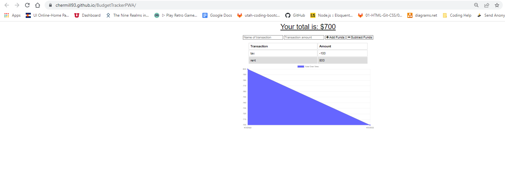

## Budget Tracker

## Description

An offline budget tool that allows additons and subtractions from available funds. Offline transactions stored in indexedDb for ease of use.

## Installation

npm install | mongo, express, morgan, compression

## Usage

start server with npm start and visit localhost:3001 in browser | Or visit pages link in Deployed section

## Deployed

Deployed App: https://chermill93.github.io/BudgetTrackerPWA/

Screenshot: 

## Credits

Module 19 code
